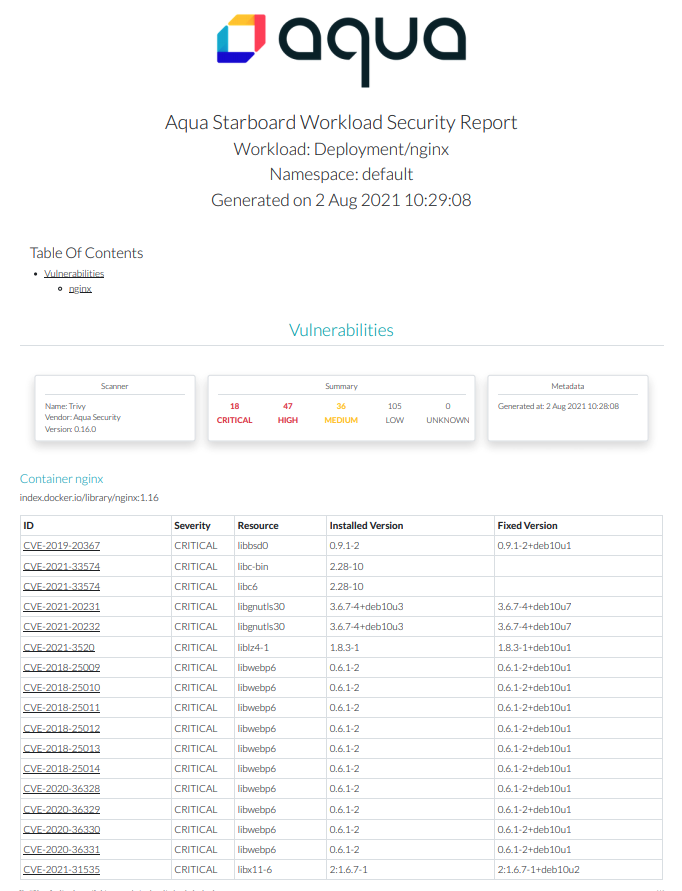

# Getting Started

## Before you Begin

You need to have a Kubernetes cluster, and the kubectl command-line tool must be configured to communicate with your
cluster. If you do not already have a cluster, you can create one by installing [minikube] or [kind], or you can use one
of these Kubernetes playgrounds:

* [Katacoda]
* [Play with Kubernetes]

You also need the `starboard` command to be installed, e.g. [From the Binary Releases]. By default, it will use the same
configuration as kubectl to communicate with the cluster.

## Scanning Workloads
As an example let's run in the current namespace an old version of `nginx` that we know has vulnerabilities:

```
kubectl create deployment nginx --image nginx:1.16
```

The easiest way to get started with Starboard is to use an imperative `starboard` command, which allows ad hoc scanning
of Kubernetes workloads deployed in your cluster.

Run the vulnerability scanner to generate vulnerability reports:

```
starboard scan vulnerabilityreports deployment/nginx
```

Behind the scenes, by default this uses [Trivy] in Standalone mode to identify vulnerabilities in the container
images associated with the specified Deployment. Once this has been done, you can retrieve the latest vulnerability
reports for this workload:

```
starboard get vulnerabilityreports deployment/nginx -o yaml
```

For a Deployment with *N* containers Starboard will create *N* instances of `vulnerabilityreports.aquasecurity.github.io`
resources. To retrieve a vulnerability report for the specified container use the `--container` flag:

```
starboard get vulnerabilityreports deployment/nginx --container nginx -o yaml
```

!!! tip
    It is possible to retrieve vulnerability reports with the `kubectl get` command, but it requires knowledge of
    Starboard implementation details. In particular, naming convention and labels and label selectors used to associate
    vulnerability reports with Kubernetes workloads.

    ```console
    $ kubectl get vulnerabilityreports -o wide
    NAME                                REPOSITORY      TAG    SCANNER   AGE   CRITICAL   HIGH   MEDIUM   LOW   UNKNOWN
    replicaset-nginx-6d4cf56db6-nginx   library/nginx   1.16   Trivy     41m   21         50     34       104   0
    ```

    To read more about custom resources and label selectors check [Custom Resource Definitions].

Moving forward, let's take the same `nginx` Deployment and audit its Kubernetes configuration. As you remember we've
created it with the `kubectl create deployment` command which applies the default settings to the deployment descriptors.
However, we also know that in Kubernetes the defaults are usually the least secure.

Run the scanner to audit the configuration using the built-in configuration checker:

```
starboard scan configauditreports deployment/nginx
```

Retrieve the configuration audit report:

```
starboard get configauditreports deployment/nginx -o yaml
```

or

```
kubectl get configauditreport -o wide
```

<details>
<summary>Result</summary>

```
NAME                          SCANNER     AGE   CRITIAL   HIGH   MEDIUM   LOW
replicaset-nginx-78449c65d4   Starboard   75s   0         0      6        7
```
</details>

!!! tip
    There's also starboard uninstall subcommand, which can be used to clean up all resources created by Starboard.
    ```
    starboard uninstall
    ```


## Generating HTML Reports

Once you scanned the `nginx` Deployment for vulnerabilities and checked its configuration you can generate an HTML
report of identified risks and open it in your web browser:

```
starboard report deployment/nginx > nginx.deploy.html
```

```
open nginx.deploy.html
```



## What's Next?

* Learn more about the available Starboard commands and scanners, such as [kube-bench] or [kube-hunter], by running
  `starboard help`.
* Read up on [Infrastructure Scanners] integrated with Starboard.

[Trivy]: ./../vulnerability-scanning/trivy.md
[Custom Resource Definitions]: ./../crds/index.md
[Katacoda]: https://www.katacoda.com/courses/kubernetes/playground/
[Play with Kubernetes]: http://labs.play-with-k8s.com/
[From the Binary Releases]: ./installation/binary-releases.md
[minikube]: https://minikube.sigs.k8s.io/docs/
[kind]: https://kind.sigs.k8s.io/docs/
[kube-bench]: https://github.com/aquasecurity/kube-bench
[kube-hunter]: https://github.com/aquasecurity/kube-hunter
[Infrastructure Scanners]: ./../configuration-auditing/infrastructure-scanners/index.md
