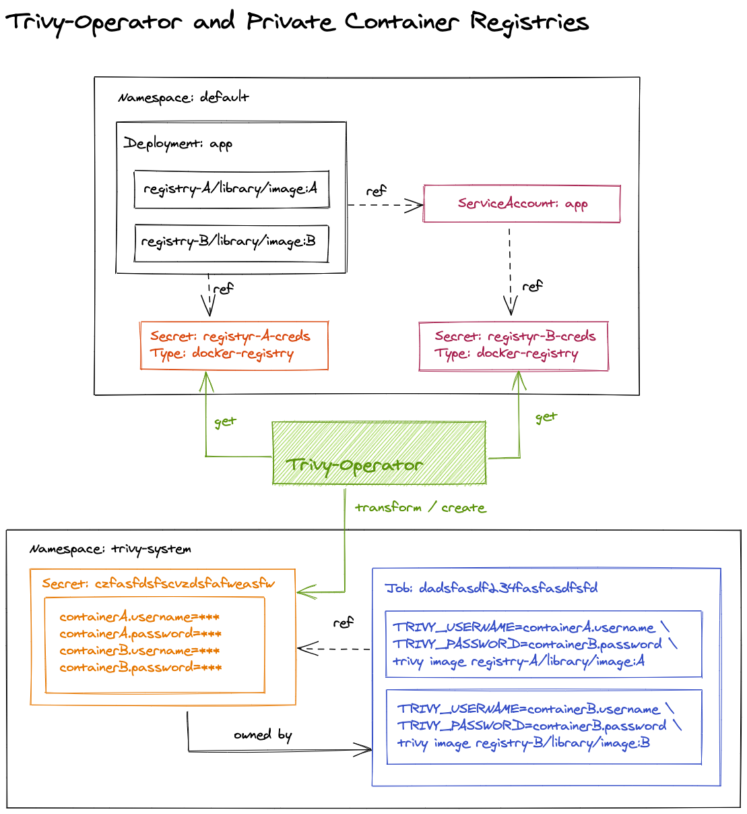

# Compatibility

## Private Registries

### Image Pull Secrets



1. Find references to image pull secrets (direct references and via service account).
2. Create the temporary secret with basic credentials for each container of the scanned workload.
3. Create the scan job that references the temporary secret. The secret has the ownerReference property set to point to the job.
4. Watch the job until it's completed or failed.
5. Parse logs and save vulnerability reports in etcd.
6. Delete the job. The temporary secret will be deleted by the Kubernetes garbage collector.

## Managed Registries

### Amazon Elastic Container Registry (ECR)

You must create an IAM OIDC identity provider for your cluster:

```
eksctl utils associate-iam-oidc-provider \
    --cluster <cluster_name> \
    --approve
```

Assuming that the operator is installed in the `<starboard_operator_namespace>`
namespace you can override the existing `starboard-operator` service account and
attach the IAM policy to grant it permission to pull images from the ECR:

```
eksctl create iamserviceaccount \
    --name starboard-operator \
    --namespace <starboard_operator_namespace> \
    --cluster <cluster_name> \
    --attach-policy-arn arn:aws:iam::aws:policy/AmazonEC2ContainerRegistryReadOnly \
    --approve \
    --override-existing-serviceaccounts
```
