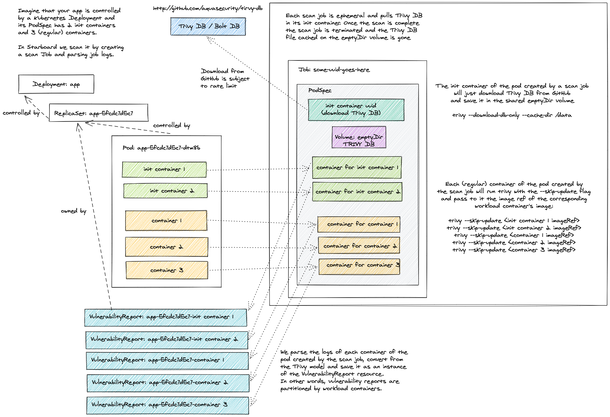
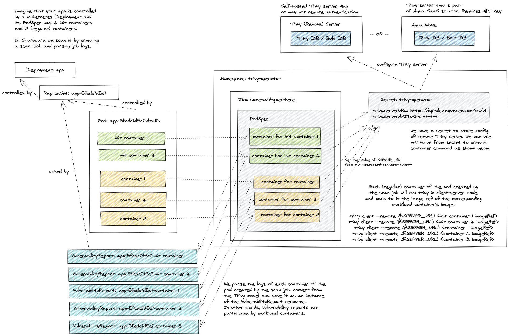

## Standalone

The default configuration settings enable Trivy `vulnerabilityReports.scanner` in [`Standalone`][trivy-standalone]
`trivy.mode`. Even though it doesn't require any additional setup, it's the least efficient method. Each Pod created
by a scan Job has the init container that downloads the Trivy vulnerabilities database from the GitHub releases page
and stores it in the local file system of an [emptyDir][emptyDir-volume] volume. This volume is then shared with
containers that perform the actual scanning. Finally, the Pod is deleted along with the emptyDir volume.



The number of containers defined by a scan Job equals the number of containers defined by the scanned Kubernetes
workload, so the cache in this mode is useful only if the workload defines multiple containers.

Beyond that, frequent downloads from GitHub might lead to a [rate limiting][gh-rate-limiting] problem. The limits are
imposed by GitHub on all anonymous requests originating from a given IP. To mitigate such problems you can add the
`trivy.githubToken` key to the `starboard` secret.

```
GITHUB_TOKEN=<your token>

kubectl patch secret starboard -n <starboard_namespace> \
  --type merge \
  -p "$(cat <<EOF
{
  "data": {
    "trivy.githubToken": "$(echo -n $GITHUB_TOKEN | base64)"
  }
}
EOF
)"
```

## ClientServer

You can connect Starboard to an external Trivy server by changing the default `trivy.mode` from
[`Standalone`][trivy-standalone] to [`ClientServer`][trivy-clientserver] and specifying `trivy.serverURL`.

```
TRIVY_SERVER_URL=<your server URL>

kubectl patch cm starboard -n <starboard_namespace> \
  --type merge \
  -p "$(cat <<EOF
{
  "data": {
    "trivy.mode":      "ClientServer",
    "trivy.serverURL": "$TRIVY_SERVER_URL"
  }
}
EOF
)"
```

The Trivy server could be your own deployment, or it could be an external service. See [Trivy documentation][trivy-clientserver]
for more information on deploying Trivy in `ClientServer` mode.

If the server requires access token and / or custom HTTP authentication headers, you may add `trivy.serverToken`
and `trivy.serverCustomHeaders` properties to the `starboard` secret.

```
SERVER_TOKEN=<your server token>
X_API_TOKEN=<your API token>

kubectl patch secret starboard -n <starboard_namespace> \
  --type merge \
  -p "$(cat <<EOF
{
  "data": {
    "trivy.serverToken":         "$(echo -n $SERVER_TOKEN | base64)",
    "trivy.serverCustomHeaders": "$(echo -n x-api-token:$X_API_TOKEN | base64)"
  }
}
EOF
)"
```



[trivy-standalone]: https://aquasecurity.github.io/trivy/latest/modes/standalone/
[emptyDir-volume]: https://kubernetes.io/docs/concepts/storage/volumes/#emptydir
[gh-rate-limiting]: https://docs.github.com/en/free-pro-team@latest/rest/overview/resources-in-the-rest-api#rate-limiting
[trivy-clientserver]: https://aquasecurity.github.io/trivy/latest/modes/client-server/
